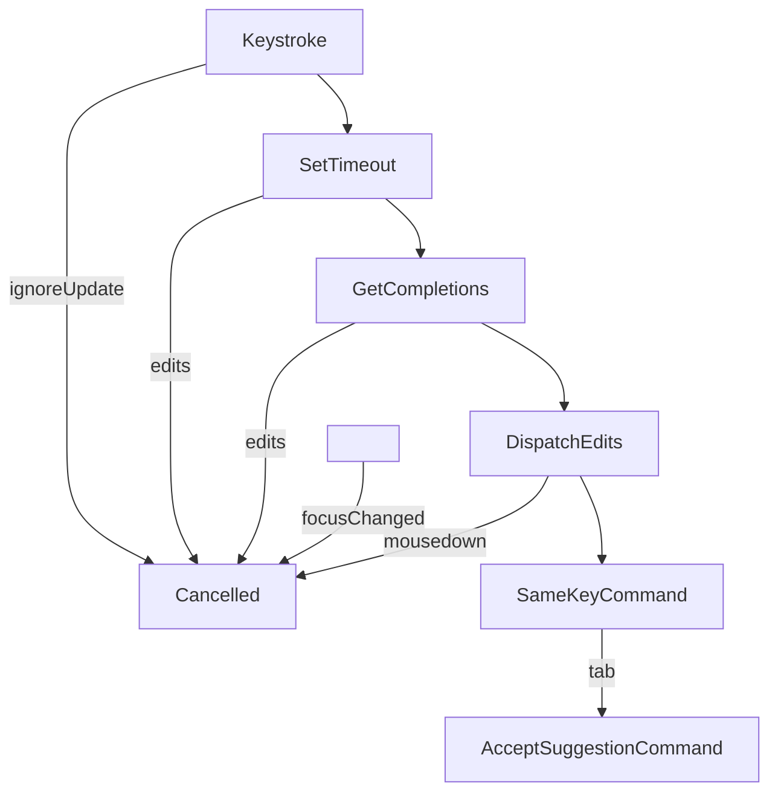

# codemirror-codeium



_Very experimental and unofficial_

Copilot-like ghost text code from [modeling-app](https://github.com/KittyCAD/modeling-app)
by [Jess Frazelle](https://github.com/jessfraz) and based on [Cursor](https://cursor.sh/).

## Documentation

See the [demo source code](https://github.com/val-town/codemirror-codeium/tree/main/demo) for
a reference to how it's used.

```ts
import { copilotPlugin } from "@val-town/codemirror-codeium";

// This is a CodeMirror extension
copilotPlugin();
```
