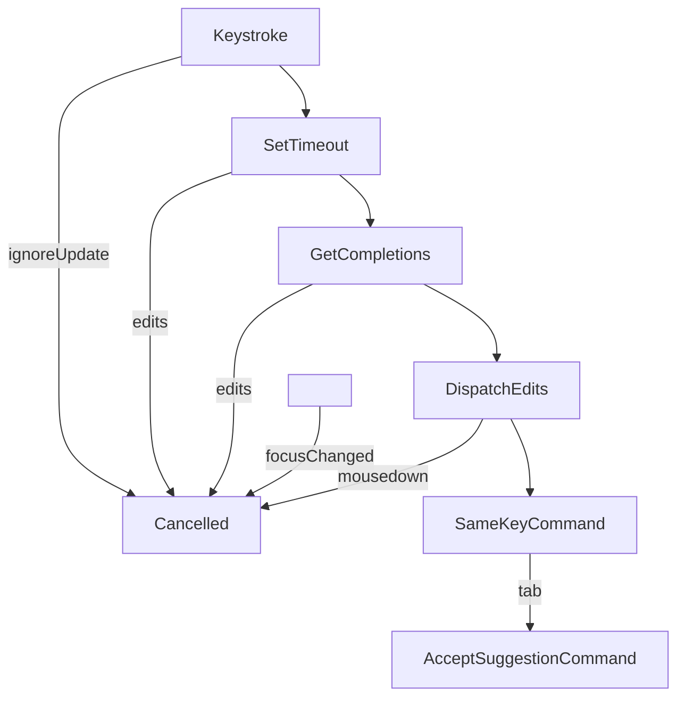

# codemirror-codeium



_Very experimental and unofficial_

Copilot-like ghost text code from [modeling-app](https://github.com/KittyCAD/modeling-app)
by [Jess Frazelle](https://github.com/jessfraz) and based on [Cursor](https://cursor.sh/).

## Documentation

See the [demo source code](https://github.com/val-town/codemirror-codeium/tree/main/demo) for
a reference to how it's used.

```ts
import { copilotPlugin } from "@valtown/codemirror-codeium";

// This is a CodeMirror extension
copilotPlugin();
```

### CSS

This adds a `.ghostText` class to CodeMirror decorations for the AI-written
text. You can add your own style for this class. The demo uses this style:

```css
.cm-ghostText,
.cm-ghostText * {
  opacity: 0.6;
  filter: grayscale(20%);
  cursor: pointer;
}

.cm-ghostText:hover {
  background: #eee;
}
```

### Architecture

This makes requests against the [Codeium](https://codeium.com/) hosted product,
using their Protocol Buffer-based interface. That's what the `buf` and `connectrpc`
modules are doing - generating and using bindings to their service.

The extension is a composite of facets, decorations, state fields, and more
that are encapsulated.
