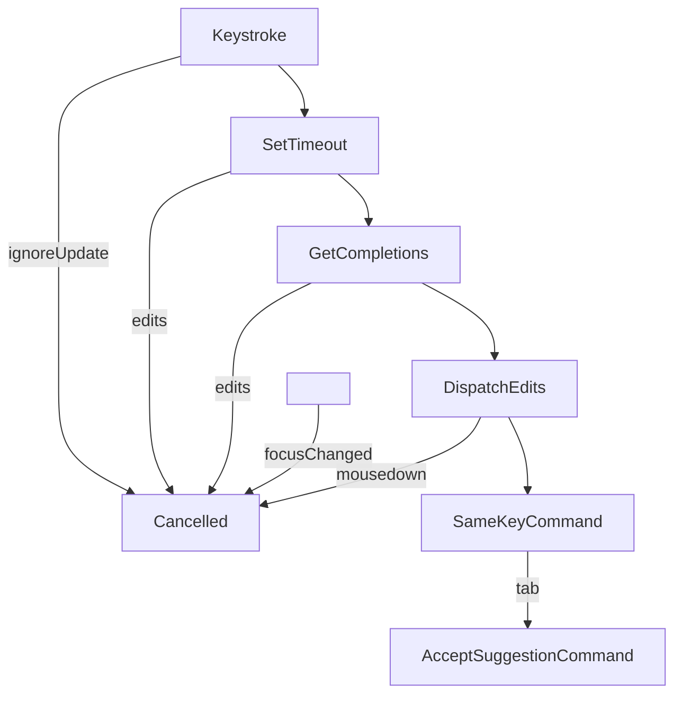

# codemirror-codeium

[](https://www.npmjs.com/package/@valtown/codemirror-codeium)



_Very experimental and unofficial_

Copilot-like ghost text code from [modeling-app](https://github.com/KittyCAD/modeling-app)
by [Jess Frazelle](https://github.com/jessfraz) and based on [Cursor](https://cursor.sh/).

## Documentation

See the [demo source code](https://github.com/val-town/codemirror-codeium/tree/main/demo) for
a reference to how it's used.

```ts
import { copilotPlugin } from "@valtown/codemirror-codeium";

// This is a CodeMirror extension
copilotPlugin();
```

### CSS

This adds a `.ghostText` class to CodeMirror decorations for the AI-written
text. You can add your own style for this class. The demo uses this style:

```css
.cm-ghostText,
.cm-ghostText * {
  opacity: 0.6;
  filter: grayscale(20%);
  cursor: pointer;
}

.cm-ghostText:hover {
  background: #eee;
}
```


### Tracking Editor Updates

Adding event listeners to the editor can be helpful if you want to implement features such as auto-save or live code rerendering.

The entire process fires three separate transactions, each causing the document to update.
1) It first adds a suggestion ghost to the editor view
2) Then it removes the ghost suggestion, both before accepting it or declining it
3) Accepting the suggestion and adding it to the doc.

You can still listen to doc updates but ignore when the Codieum events fire by doing something like this:
```
new EditorView({
	extensions: [
		EditorView.updateListener.of((v) => {
			if (v.docChanged) {
				for(let i = 0; i < v.transactions[0].annotations.length; i++) {
					if(v.transactions[0].annotations[i].value === "aiSuggestion" || v.transactions[0].annotations[i].value === "aiRemoveGhost") {
						return;
					}
				}
		
				// Use the current document state
				console.log(v.state.doc.toString());
			}
		})
	]
);
```

### Architecture

This makes requests against the [Codeium](https://codeium.com/) hosted product,
using their Protocol Buffer-based interface. That's what the `buf` and `connectrpc`
modules are doing - generating and using bindings to their service.

The extension is a composite of facets, decorations, state fields, and more
that are encapsulated.
